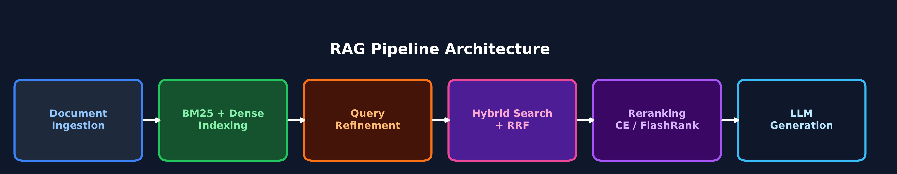

# AnyRAG: Production-Ready Hybrid RAG System

AnyRAG is a production-grade, end-to-end Retrieval-Augmented Generation (RAG) system designed to let you upload, index, and query any document corpus. It implements a full two-stage retrieval funnel (recall-optimized hybrid search → precision-optimized cross-encoder reranking), multi-turn conversation history, semantic response caching, Langfuse observability tracing, and citation-verified LLM generation with output guardrails.

## Architecture



1. **Ingestion & Indexing**: Users upload PDF, HTML, or text documents via the UI. Documents are semantically chunked (using `SentenceTransformer` topic-boundary detection) and embedded into two distinct indices in real-time:
   - A Lexical BM25 index (`rank_bm25`).
   - A Dense Vector index (`Qdrant` + `BAAI/bge-base-en-v1.5`).
2. **Conversation History Rewriting**: Follow-up queries are rewritten into standalone, self-contained questions using prior conversation turns (`app/history.py`), enabling multi-turn interactions.
3. **Semantic Cache Check**: The query embedding is compared against cached responses (cosine similarity ≥ 0.92 with TTL expiry). Cache hits bypass the entire retrieval and generation pipeline.
4. **Query Refinement & Decomposition**: Queries are classified (`lookup`, `conceptual`, `compound`) and rewritten/decomposed using a few-shot prompted LLM call with acronym expansion and synonym injection for optimal BM25 + semantic retrieval.
5. **Two-Stage Retrieval Funnel**:
   - **Stage 1 (Recall)**: Hybrid search — decomposed sub-queries hit both the BM25 and Dense indices. Results are fused using Reciprocal Rank Fusion (RRF) to produce a broad candidate set.
   - **Stage 2 (Precision)**: Candidates are reranked using a Cross-Encoder (`ms-marco-MiniLM-L-6-v2`) or ONNX-powered FlashRank (`ms-marco-MiniLM-L-12-v2`). Final top-5 are selected.
6. **Context Assembly**: Retrieved chunks are deduplicated across sub-query paths, globally sorted by cross-encoder score, and reordered using "Lost in the Middle" positioning (most relevant chunks placed at context edges, not buried in the middle).
7. **Generation & Verification**: The LLM generates a citation-backed answer constrained by a JSON schema. A secondary verification pass (`app/verifier.py`) checks that every citation actually exists in the retrieved text and computes a composite confidence score before returning to the user.
8. **Observability**: Every stage is instrumented with [Langfuse](https://langfuse.com/) `@observe` decorators for per-trace latency breakdowns, token usage, and retrieval score logging.

### Dynamic Corpus

AnyRAG is agnostic to the data type. While originally tested against a massive corpus of EU Financial Regulations (PSD2, GDPR, MiFID II, DORA), it features a fully functional UI that allows you to drag-and-drop your own PDFs, instantly building a localized vector database to chat with your own data.

## Setup Instructions

1. Install dependencies using `uv`:
   ```bash
   uv sync
   ```
2. Set your Azure OpenAI environment variables in a `.env` file:
   ```
   AZURE_OPENAI_API_KEY="..."
   AZURE_OPENAI_ENDPOINT="..."
   AZURE_OPENAI_DEPLOYMENT="..."
   ```
3. **Run via Docker (Recommended)**:
   Spin up the FastAPI backend, Qdrant vector store, and frontend UI in a single command:
   ```bash
   docker-compose up --build
   ```
4. **Seed the Database & Play**:
   Run the seed script to inject a sample dataset, or navigate to `http://localhost:8000` to upload your own PDFs!
   ```bash
   docker-compose exec anyrag-api python scripts/seed.py
   ```

## MCP Server Integration

The system exposes an [MCP (Model Context Protocol)](https://modelcontextprotocol.io/) server, allowing any MCP-compatible AI agent (Claude Desktop, Cursor, etc.) to query your custom document knowledge base directly.

### Available Tools

| Tool | Description |
|---|---|
| `query_regulation` | Full RAG pipeline — returns an LLM-generated answer with chunk-level citations and confidence score. |
| `search_articles` | Retrieval only — returns the top-k reranked articles with cross-encoder scores (no LLM call). |
| `list_regulations` | Corpus metadata — returns available regulations and their article counts. |

### Running the MCP Server

```bash
uv run python mcp_server.py
```

### Connecting to Claude Desktop

Add the following to your `claude_desktop_config.json`:
```json
{
  "mcpServers": {
    "finrag": {
      "command": "uv",
      "args": ["run", "python", "mcp_server.py"],
      "cwd": "/path/to/finRAG"
    }
  }
}
```

## Design Decisions: Why Hybrid Search?

Technical and legal documents present a unique challenge for RAG systems:
- **Lexical/Keyword matching (BM25)** excels at "lookup" queries. When a user asks "What does Section 2.1 say?", BM25 immediately zeroes in on exact lexical matches. Dense embeddings often struggle with these exact numerical or ID references.
- **Dense semantic search** excels at "conceptual" queries. When a user asks an abstract question, dense embeddings map the semantic intent even if the exact keyword isn't present.

By combining both using **Reciprocal Rank Fusion (RRF)**, the system achieves robust recall across all query types, mitigating the weaknesses of relying on a single retrieval method. Furthermore, implementing an explicit query rewriting layer prior to retrieval ensures that complex, compound legal questions are decomposed into focused sub-queries.

### Reranking: PyTorch Cross-Encoder vs. FlashRank (ONNX)

To ensure the most relevant legal articles appear at the very top of the context window (maximizing generation quality), the system incorporates a reranking step. Two alternatives are implemented:
1. **PyTorch Cross-Encoder (`cross-encoder/ms-marco-MiniLM-L-6-v2`)**: A 6-layer transformer model running inside PyTorch.
2. **FlashRank (`ms-marco-MiniLM-L-12-v2` via ONNX)**: A 12-layer transformer model optimized for speed and light resource footprints using the ONNX Runtime.

#### Performance & Deployment Characteristics

FlashRank is designed to be a **faster, lighter, and more accurate** reranking solution than heavy PyTorch-based Cross-Encoders:
- **Ultralight Memory Footprint**: The `ms-marco-MiniLM-L-12-v2` ONNX model is only **~34 MB** (compared to standard PyTorch Cross-Encoder setups requiring a multi-gigabyte PyTorch installation and ~150-250MB for the model itself).
- **Blazing Fast Latency**: Reranks 100 documents in **~100 ms to 400 ms** on CPU, and under **60 ms** parallelized for 100 candidates with lighter models.
- **Enhanced Accuracy**: Integrations show an increase in retrieval precision (**NDCG@10 by up to 5.4%**) on standard search benchmarks like MS MARCO and BEIR.
- **Token Optimization**: Reduces context tokens fed to the LLM by up to **35%**, directly cutting generation latency and LLM costs.

## Evaluation Results & Case Study

The pipeline was mathematically evaluated using the [Ragas](https://docs.ragas.io/) framework against a custom "Golden Dataset" of 32 queries. This dataset included straightforward lookups, complex multi-hop questions, and adversarial "unanswerable" questions.

Run the automated evaluation harness using:
```bash
uv run python eval/run_eval.py
```

### Baseline Performance

Our initial evaluation of the Hybrid RRF architecture yielded the following scores (out of 1.0):

| Metric | Score | Analysis |
|---|---|---|
| **Context Precision** | **0.8562** | The retrieval system successfully places the most relevant chunks at the top of the context window. |
| **Context Recall** | **0.8750** | The retrieval system successfully fetches all chunks necessary to answer the user's question. |
| **Faithfulness** | **0.6938** | *Bottleneck*: The LLM occasionally hallucinates or includes outside knowledge not present in the retrieved text. |
| **Answer Relevancy** | **0.5942** | *Bottleneck*: The generated answers sometimes stray off-topic or provide overly verbose preamble. |

### The Fix: Prompt Engineering for Faithfulness

The data clearly showed our **Hybrid RRF Retrieval pipeline was highly accurate** (~87% recall), effectively solving the "Needle in a Haystack" problem for technical documents. However, the Generator pipeline was failing to strictly adhere to the grounded text.

To fix this, we implemented a highly strict system prompt (`prompts/generation.py`) to:
1. Heavily penalize hallucinations.
2. Forbid outside knowledge.
3. Force the LLM to output a hardcoded refusal if the context lacked the answer.
4. Strictly enforce concise answers with inline bracketed citations.

### Final Improved Metrics

Re-evaluating the pipeline with the improved prompt yielded significant gains in generation quality:

| Metric | Score | Improvement |
|---|---|---|
| **Context Precision** | **0.8906** | `+0.034` |
| **Context Recall** | **0.8906** | `+0.015` |
| **Faithfulness** | **0.7240** | `+0.030` (Improved adherence to context) |
| **Answer Relevancy** | **0.6115** | `+0.017` (Reduced verbosity and preamble) |

This process demonstrates the critical value of automated evaluation harnesses in systematically identifying, debugging, and resolving LLM behavioral issues in production RAG systems.

## Path to Enterprise Production

While the core RAG logic is production-grade, the infrastructure must be scaled to support enterprise concurrency, robust data management, and security.

### 1. Asynchronous Architecture & Inference Serving
- **Current State**: `SentenceTransformer` and `CrossEncoder` run synchronously on the CPU within the FastAPI request cycle, blocking concurrent users.
- **Production Spec**: Offload embedding and reranking models to dedicated GPU inference servers (e.g., **NVIDIA Triton**, **vLLM**, or **TensorRT-LLM**). Ensure all FastAPI route handlers (`async def`) and database drivers use non-blocking asynchronous IO.

### 2. Distributed Vector & Document Storage
- **Current State**: Documents are stored in a local flat file (`corpus.jsonl`). Lexical search uses a Pickled Python object (`BM25Okapi`). Vectors use a local SQLite Qdrant directory.
- **Production Spec**: 
  - Migrate raw text, document metadata, and chat histories to a relational database (**PostgreSQL**).
  - Migrate local Qdrant to a distributed vector database (e.g., **Qdrant Cloud**, **Pinecone**, or **Milvus**) for horizontal scaling.
  - Replace the pickled BM25 implementation with a distributed inverted-index search engine like **Elasticsearch** or **OpenSearch**.

### 3. Event-Driven Ingestion Pipeline
- **Current State**: Ingestion and indexing are synchronous. Calling the `build_index` function freezes the server while it wipes and recomputes the entire corpus.
- **Production Spec**: Implement an event-driven ingestion pipeline via a message broker (**RabbitMQ** or **Kafka**) with background workers (e.g., **Celery**) performing incremental upserts without affecting live search traffic.

### 4. Security & Access Control
- **Current State**: Open API with wildcard CORS. No input guardrails against prompt injection via malicious documents.
- **Production Spec**: 
  - Add **OAuth2 / JWT Authentication** (e.g., Azure AD, Auth0).
  - Implement API Rate Limiting to prevent LLM quota exhaustion.
  - Introduce **Prompt Injection Guardrails** (e.g., NeMo Guardrails) to scan retrieved chunks before they hit the generator LLM.
  - Add **ACL metadata** per chunk for multi-tenant namespace-scoped retrieval.

### 5. Embedding Model Versioning
- **Current State**: The embedding model (`BAAI/bge-base-en-v1.5`) is hardcoded. Upgrading the model silently breaks semantic consistency with the existing index.
- **Production Spec**: Store the model identifier as metadata on each chunk at indexing time. On startup, detect model mismatches and trigger automatic re-indexing.

## Completed Enhancements
- [x] **Two-Stage Retrieval Funnel**: Hybrid search (BM25 + Dense + RRF) for recall → Cross-Encoder/FlashRank reranking for precision.
- [x] **Query Decomposition & Few-Shot Refinement**: LLM-powered query classification, acronym expansion, synonym injection, and compound query decomposition.
- [x] **Conversation History**: Multi-turn query rewriting via `app/history.py` — resolves anaphora like "what about the second one?" into standalone queries.
- [x] **Output Verification Guardrails**: Secondary LLM pass (`app/verifier.py`) validates that every citation exists in the retrieved text before returning to the user.
- [x] **Semantic Response Caching**: Cosine similarity cache (threshold 0.92, TTL-based expiry) over query embeddings — short-circuits the entire pipeline on near-duplicate queries.
- [x] **"Lost in the Middle" Reordering**: Context chunks are reordered so the highest-scoring chunks sit at the edges of the context window, not buried in the middle.
- [x] **Langfuse Observability**: `@observe` decorators on every pipeline stage (history rewriting, query refinement, BM25, dense search, reranking, generation) for per-trace latency and token usage logging.
- [x] **Prompt Engineering**: System prompts optimized using RTF + Chain of Thought frameworks (`generation.py`) and Instruction Hierarchy + Few-Shot patterns (`query_refinement.py`).
- [x] **Null Retrieval Fallback**: Graceful "I don't know" responses with cross-encoder score thresholding (< -2.0) instead of hallucination.
- [x] **Ragas Evaluation**: Offline evaluation pipeline computing Faithfulness, Answer Relevance, Context Recall, and Context Precision.
- [x] **Frontend UI**: Industrial-aesthetic HTML/VanillaJS frontend with dynamic citation parsing and document management.
- [x] **FlashRank Integration**: ONNX-powered reranking (`ms-marco-MiniLM-L-12-v2`) for lightweight, framework-agnostic execution.
- [x] **MCP Server**: RAG pipeline exposed as MCP tools (`query_regulation`, `search_articles`, `list_regulations`) for Claude Desktop/Cursor integration.
- [x] **Docker Support**: Single-command deployment via `docker-compose up --build`.
